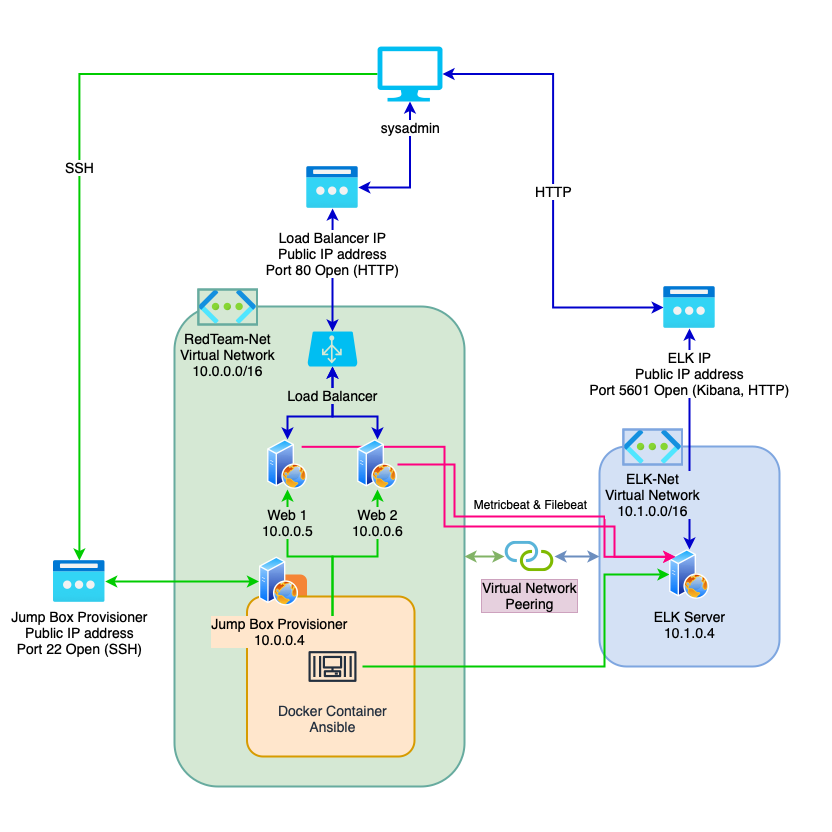
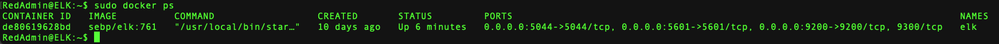

## Automated ELK Stack Deployment

The files in this repository were used to configure the network depicted in the diagram below.

These files have been tested and used to generate a live ELK deployment on Azure. They can be used to either recreate the entire deployment pictured above. Alternatively, select playbooks in the `ansible` folder may be used to install only certain pieces of it, such as only Filebeat or the DVWA.

This document contains the following details:
- Description of the Topology
- Access Policies
- ELK Configuration
  - Beats in Use
  - Machines Being Monitored
- How to Use the Ansible Build

### Description of the Topology

The main purpose of this network is to expose a load-balanced and monitored instance of DVWA, the D*mn Vulnerable Web Application.

`Load balancing` ensures that the application will be highly available, in addition to restricting inbound access to the network.
Load balancers can help protect against DDoS attacks and help keep the web server available if one of the machines goes down.

Integrating an `ELK server` allows system admins to easily monitor the vulnerable VMs for changes to the file system of the machines on the network and allows us to monitor a suite of system metrics. 

`Filebeat` logs and visualizes information about the file system including which files have changed and when. 
`Metricbeat` logs and visualizes data from the systems and services running on the server such as uptime, permission escalation attempts, and more.

The configuration details of each machine may be found below.

| Name                 | Function   | IP Address | Operating System | Public IP               |
|----------------------|------------|------------|------------------|-------------------------|
| Jump Box Provisioner | Gateway    | 10.0.0.4   | Linux            | Public Jump Box IP      |
| Web 1                | Web Server | 10.0.0.5   | Linux            | Load Balancer Public IP |
| Web 2                | Web Server | 10.0.0.6   | Linux            | Load Balancer Public IP |
| ELK                  | Monitor    | 10.1.0.4   | Linux            | ELK Public IP           |

**Note** We have provisioned an Azure load balancer in front of Web 1 and Web 2, they both share the load balancer's front end IP.

### Access Policies

The machines on the internal network are not exposed to the public Internet. 

Only the Jump Box Provisioner can accept a remote connection. Access to this machine is only allowed from the public IP address of the system administrator.

Machines within the network can only be accessed by the Jump Box Provisioner.

A summary of the access policies in place can be found in the table below.

| Name     | Publicly Accessible | Allowed IP Addresses | Ports Open            |
|----------|---------------------|----------------------|-----------------------|
| Jump Box | Yes                 | sysadmin's ip        |                       |
| Web 1    | No                  | 10.0.0.4             | 80 (HTTP)             |
| Web 2    | No                  | 10.0.0.4             | 80 (HTTP)             |
| ELK      | No                  | 10.0.0.4             | 5601 to sysadmin's ip |

### Elk Configuration

Ansible was used to automate configuration of the ELK machine. No configuration was performed manually, which allows us to rapidly and securely deploy this ELK configuration on any machine to monitor its network traffic. Once the playbook has ran, logs & traffic can be monitored remotely. 

The `ansible/install-elk.yml` playbook implements the following tasks:

- Installs Docker & PIP3
- Downloads and launches an ELK Docker image
- Enables the ELK service to start on boot

The Filebeat & Metricbeat playbooks are similar:

- Downloads and installs Metricbeat onto the _target machines_
- Creates config file & enables Docker module
- Starts Metricbeat service, enables service to start on boot

The following screenshot displays the result of running `docker ps` after successfully configuring the ELK instance. *Note* You must SSH into the ELK machine from your Ansible container, for example `ssh@RedAdmin10.1.0.4`, before running `docker ps`!

### Target Machines & Beats
This ELK server is configured to monitor the Web 1 and Web 2 machines (10.0.0.5, 10.0.0.6)

We have installed Metricbeat and Filebeat on these machines.

### Using the Playbook
In order to use the playbooks, you will need to have an Ansible control node already configured.
